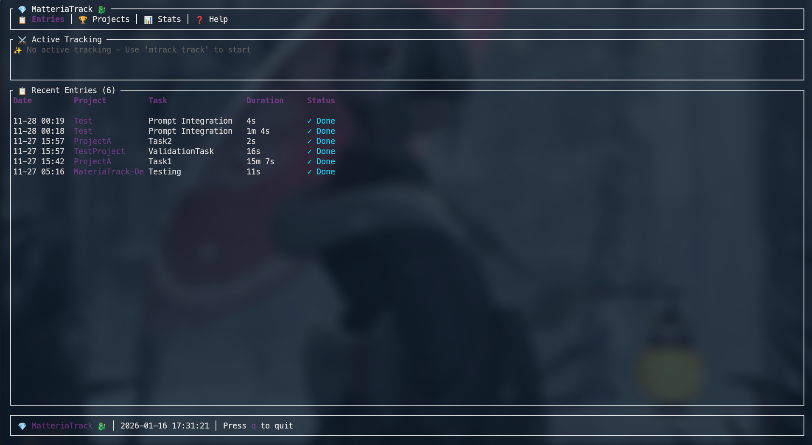

# MatteriaTrack 💎

<p align="center">
  
</p>

[](https://github.com/ind4skylivey/matteria-track/releases)
[](https://github.com/ind4skylivey/matteria-track/actions)
[](LICENSE)

> **Mystical Final Fantasy-themed CLI time tracker for power users**

_"Master your time, master your destiny"_

```
╔══════════════════════════════════════════════════════════════╗
║  💎 MatteriaTrack - Time Tracking Forged in Mako Energy 💎    ║
║     "Master your time, master your destiny"                  ║
╚══════════════════════════════════════════════════════════════╝
```

## Why you'll like it

- ⚡ Fast: async, fuzzy finder, zero telemetry.
- 🔐 Safe: optional GPG encryption + tamper-evident audit log.
- 🔗 Connected: Git auto-import, Obsidian sync, statusbar output.
- 🎨 Personal: 6 elemental themes + achievements.
- 📅 Calendar TUI: Interactive calendar with event management.
- 🧭 Portable: release binaries for Linux (glibc, musl) and macOS (Intel/ARM).

## Features

🔥 **6 Elemental Themes** - Fire, Ice, Lightning, Earth, Wind, Bahamut

⚔️ **Git Integration** - Auto-import commits as time entries

📓 **Obsidian Sync** - Bidirectional daily notes synchronization

📅 **Calendar TUI** - Interactive calendar with event management

🏆 **20+ Achievements** - Unlock rewards as you track

🔒 **GPG Encryption** - Optional encrypted database

📊 **Statusbar Support** - DWM, Polybar, i3blocks, Waybar

🍅 **Pomodoro Timer** - Built-in focus sessions

🔍 **Fuzzy Finder** - Quick project/task switching

## Showcase

<p align="center">
  
</p>

## Quick Start

### Install

```bash
curl -sSL https://raw.githubusercontent.com/ind4skylivey/matteria-track/main/build/install.sh | bash
```

### Or via package manager / binaries

```bash
# Arch Linux (AUR)
yay -S materiatrack

# Homebrew (macOS)
brew install ind4skylivey/tap/materiatrack

# Release binaries (no build)
# Linux glibc (x86_64), Linux musl (x86_64), macOS Intel, macOS Apple Silicon
# See Downloads section below for direct links/checksums
```

### Basic Usage

```bash
# Start tracking
mtrack track -p "MyProject" -t "Development"

# Check status
mtrack status

# Stop tracking
mtrack finish

# View entries
mtrack list

# Statistics
mtrack stats --today
```

## Downloads

Latest release binaries (v1.0.3):

| Target                     | Asset                                                 |
| -------------------------- | ----------------------------------------------------- |
| Linux x86_64 (glibc)       | `materiatrack-1.0.3-x86_64-unknown-linux-gnu.tar.gz`  |
| Linux x86_64 (musl/static) | `materiatrack-1.0.3-x86_64-unknown-linux-musl.tar.gz` |
| macOS x86_64               | `materiatrack-1.0.3-x86_64-apple-darwin.tar.gz`       |
| macOS ARM64                | `materiatrack-1.0.3-aarch64-apple-darwin.tar.gz`      |
| Checksums                  | `SHA256SUMS`                                          |

All assets live at the GitHub Release page: https://github.com/ind4skylivey/matteria-track/releases/tag/v1.0.3

## Demo

```
$ mtrack track -p "MatteriaTrack" -t "README"

💎 MatteriaTrack v1.0.0
━━━━━━━━━━━━━━━━━━━━━━━━━━━━━━━━━━━━━━━━
🔥 Started tracking: MatteriaTrack > README
   ⏰ 14:30:00

$ mtrack status

💎 Currently Tracking
━━━━━━━━━━━━━━━━━━━━━━━━━━━━━━━━━━━━━━━━
🏔️ Project: MatteriaTrack
⚔️ Task: README
⏱️ Duration: 00:45:23
   Started: 14:30:00

$ mtrack finish

✓ Tracked: MatteriaTrack > README (0h 45m)
```

## Themes

Choose your elemental Materia:

| Theme        | Description       | Preview       |
| ------------ | ----------------- | ------------- |
| 🔥 Fire      | Burning passion   | Red/Orange    |
| ❄️ Ice       | Cool precision    | Blue/Cyan     |
| ⚡ Lightning | Electric energy   | Yellow/Purple |
| 🌍 Earth     | Grounded strength | Green/Brown   |
| 💨 Wind      | Ethereal freedom  | White/Gray    |
| 🐉 Bahamut   | Ultimate power    | Purple/Gold   |

```bash
# Set theme in config
[ui]
theme = "bahamut"
```

## Integrations

### Git

```bash
# Auto-import commits while tracking
[tracking]
auto_import_git = true
```

### Obsidian

```bash
# Sync with daily notes
[integrations]
obsidian_path = "~/Documents/Obsidian/Vault"
```

### Statusbar

```bash
# DWM/dwmblocks
mtrack statusbar

# Polybar
mtrack statusbar --format polybar

# Waybar (JSON)
mtrack statusbar --format waybar
```

## Achievements

Unlock achievements as you master time tracking:

- 💎 **Materia Equipped** - First tracked entry
- ⚡ **Limit Break** - 500 hours tracked
- 📅 **Week Warrior** - 7 day streak
- 🏅 **SOLDIER 1st Class** - 100 day streak
- 🎮 **???** - _Secret achievement_

```bash
mtrack achievements
```

## Documentation

- [📖 User Guide](docs/USER_GUIDE.md)
- [Installation Guide](docs/INSTALL.md)
- [Configuration](docs/CONFIGURATION.md)
- [Integrations](docs/INTEGRATIONS.md)
- [Themes](docs/THEMES.md)
- [Achievements](docs/ACHIEVEMENTS.md)
- [Calendar TUI](docs/calendar-tui.md)
- [Contributing](docs/CONTRIBUTING.md)

## Command Reference

| Command     | Alias | Description         | Key Options                         |
| ----------- | ----- | ------------------- | ----------------------------------- |
| `track`     | `t`   | Start tracking      | `-p`, `-t`, `--begin`, `-n`         |
| `finish`    | `f`   | Stop tracking       | `-n`, `--end`                       |
| `status`    | `s`   | Show current status |                                     |
| `list`      | `l`   | List entries        | `--since`, `--limit`, `--total`     |
| `stats`     |       | Statistics          | `--today`, `--week`, `--by-project` |
| `project`   |       | Manage projects     | `add`, `list`, `update`, `remove`   |
| `task`      |       | Manage tasks        | `add`, `list`, `update`, `remove`   |
| `dashboard` | `ui`  | TUI Dashboard       |                                     |
| `calendar`  | `cal` | Calendar TUI        | `--theme`, `--add`                  |
| `statusbar` |       | Statusbar output    | `--format`                          |
| `config`    |       | Manage config       | `edit`, `show`, `set`               |
| `import`    |       | Import data         | `--zeit`, `--json`                  |
| `export`    |       | Export data         | `--format`, `--output`              |

## Configuration Reference

Configuration file is located at `~/.config/materiatrack/config.toml`.

```toml
[ui]
theme = "fire"              # Themes: fire, ice, lightning, earth, wind, bahamut

[tracking]
auto_import_git = true      # Use commit timestamps if inside a git repo
git_repo_path = ""          # Override git repo path

[notifications]
enable = true               # Desktop notifications
reminder_interval = 30      # Minutes between "still tracking" reminders

[integrations]
obsidian_path = "~/Vault"   # Path to Obsidian vault for daily note sync

[security]
enable_encryption = false   # Encrypt database with GPG
encryption_key = ""         # GPG Key ID (required if enabled)
enable_audit_log = true     # Log all changes to validation_log.md
```

## Building from Source

```bash
git clone https://github.com/ind4skylivey/matteria-track.git
cd matteria-track
cargo build --release
./build/install.sh --local
```

## Requirements

- Rust 1.70+ (for building)
- SQLite (bundled)
- GPG (optional, for encryption)
- libnotify (optional, for notifications)

## Contributing

Contributions welcome! See [CONTRIBUTING.md](docs/CONTRIBUTING.md)

## License

MIT License - see [LICENSE](LICENSE)

## Credits

Inspired by:

- [Zeit](https://github.com/mrusme/zeit) - Original time tracker
- Final Fantasy VII - Theme and aesthetics
- The Rust community

---

<p align="center">
  <i>"The Materia awaits your command"</i>
</p>
